<div align="center">
  <h1>SILICON</h1>
  <p><strong>A GPU built entirely in software.</strong></p>
  <p>
    <a href="https://github.com/OthmaneBlial/silicon/actions/workflows/ci.yml"></a>
    <a href="https://github.com/OthmaneBlial/silicon/releases/latest"></a>
  </p>
  <p>
    <a href="https://othmaneblial.github.io/silicon/">Project site</a> ·
    <a href="https://othmaneblial.github.io/silicon/docs.html">Online docs</a> ·
    <a href="assets/demos/spirv_showcase.mp4">Watch the render</a>
  </p>
  
  <p><sub>GLSL → SPIR-V → SIR → CPU framebuffer</sub></p>
</div>

SILICON is an experimental programmable graphics engine written in Rust. It
executes vertex and fragment work, clipping, rasterization, texturing, depth,
stencil, and blending on the CPU. The window displays the finished framebuffer.

<table>
  <tr>
    <td width="50%"></td>
    <td width="50%"></td>
  </tr>
  <tr>
    <td align="center"><sub>GLSL SPIR-V, GGX lighting, normal maps</sub></td>
    <td align="center"><sub>Cube-map sampling and environment reflections</sub></td>
  </tr>
</table>

<details>
  <summary>More render samples</summary>
  <table>
    <tr>
      <td width="50%"></td>
      <td width="50%"></td>
    </tr>
    <tr>
      <td align="center"><sub>4× multisample coverage</sub></td>
      <td align="center"><sub>Trilinear vs. 16× anisotropic filtering</sub></td>
    </tr>
  </table>
</details>

**Explore:** [Run SILICON](#run-it) · [Rust API](#use-the-rust-api) ·
[Compute](#first-compute-kernel) · [Architecture](docs/architecture.md) ·
[Pipeline](docs/graphics-pipeline.md) · [SPIR-V limits](docs/spirv.md) ·
[Capabilities](#what-works) · [Benchmarks](#measure-performance) ·
[Limits](#boundaries) · [Roadmap](docs/roadmap.md)

## Run it

[Download the macOS ARM64 CLI](https://github.com/OthmaneBlial/silicon/releases/latest)
with checksums, or build from source:

```sh
git clone https://github.com/OthmaneBlial/silicon
cd silicon
cargo run --release -p silicon-cli -- run spirv_showcase --threads 4
```

Escape exits, Space pauses, arrows adjust rotation. The window presents an
already rendered CPU framebuffer. On macOS `minifb` uses Metal for that final
pixel presentation; no scene geometry or SILICON shading runs on the host GPU.
Headless rendering requires no graphics device or display. Render a PNG with:

```sh
cargo run --release -p silicon-cli -- render assets/scenes/showcase.json --output output/scene.png
```

<details>
<summary>More scenes and runnable examples</summary>

```sh
cargo run --release -p silicon-cli -- render assets/scenes/pbr_showcase.json --backend simd --threads 4 --output output/pbr.png
cargo run --release -p silicon-cli -- render assets/scenes/cubemap_showcase.json --backend simd --threads 4 --output output/cubemap.png
cargo run --release -p silicon-cli -- render cubemap_showcase --samples 4 --backend simd --threads 4 --output output/cubemap-msaa4.png
cargo run --release -p silicon-cli -- render anisotropy_showcase --output output/anisotropy.png
cargo run --release -p silicon-cli -- render stencil --backend simd --threads 4 --output output/stencil.png
cargo run --release --example triangle
cargo run --release --example textured_cube
cargo run --release --example stencil
cargo run --release --example rust_api
cargo run --release --example vulkan_like
cargo run --release --example khronos_hello_triangle
```
</details>

Requires Rust 1.95.0 (pinned). macOS ARM64 was run locally, including the window.
Linux x86-64 and ARM64 are CI targets. Window mode on Linux uses X11; the
headless renderer works without X11 at runtime. Other platforms are unverified.

## Use the Rust API

The supported Rust integration surface is [`silicon::api`](docs/rust-api.md).
`Device` creates bounded SPIR-V shader modules, links them into an immutable
pipeline, creates owned typed buffers and command buffers, and submits commands
into an explicit `Renderer`. The renderer owns the output size and framebuffer.
`examples/rust_api.rs` is a runnable end-to-end sample:

```sh
cargo run --release --example rust_api
```

It writes `output/rust_api.png`. Shader modules currently accept SILICON's
documented SPIR-V 1.0 graphics subset; this is not a general-purpose shader
compiler or Vulkan API.

The versioned C ABI is documented in [docs/c-api.md](docs/c-api.md), with its
public header in `crates/silicon-c-api/include/silicon.h`. Its standalone C
smoke test renders and reads back a triangle:

```sh
sh crates/silicon-c-api/scripts/test.sh
```

## First compute kernel

The experimental SIR compute path runs bounded 3D workgroups on the CPU. It
supports checked storage-buffer layouts, staged writes, shared memory and
barriers, scalar f32 atomics, plus a narrow GLSL/SPIR-V vec4 and uint-atomic
path. Try a proof:

| Example | Run |
| --- | --- |
| SIR vector addition · 4,096 checked outputs | `cargo run --release --example compute_vector_add` |
| GLSL/SPIR-V vector addition | `cargo run --release --example compute_spirv_vector_add` |
| Guarded inversion · 4,100 vectors | `cargo run --release --example compute_spirv_invert` |
| Shared `vec4[64]` broadcast and barrier | `cargo run --release --example compute_spirv_shared` |
| GLSL uint atomics · 64 workgroups | `cargo run --release --example compute_spirv_atomic_uint` |
| Shared-memory workgroup reversal | `cargo run --release --example compute_shared_memory` |
| Cross-workgroup atomic prefix · 16 results | `cargo run --release --example compute_atomics` |
| Scalar/SIMD4 comparison with Rust loops | `cargo run --release --example compute_bench` |

General-purpose compute remains unsupported. See the [compute contract and
limits](docs/compute.md).

Phase 68 adds a separate Rust-only [Vulkan-like subset](docs/vulkan-like.md)
with instance/device setup, typed resources, descriptor-like bindings, an
offscreen render pass and synchronous indexed drawing. `examples/vulkan_like.rs`
writes `output/vulkan_like_triangle.png`. It is not a Vulkan loader, ABI, or
conformant implementation.

Phase 69 adapts KhronosGroup's Apache-2.0 Vulkan `hello_triangle` through that
subset. The original positions and RGB colors, adapted vertex shader, and
unchanged upstream fragment shader run through SILICON. See the
[source, license, and adaptation notes](docs/third-party-demo.md).

Phase 70 is an experimental, playable slice built around external Freedoom
Phase 1 maps. The renderer loads WAD geometry, sky, and sprites, then runs the
scene through SILICON's software pipeline. E1M1 measures 1,871 triangles and
214 draws across 570 of 682 visible BSP leaves; its output is byte-identical to
the checked-in capture.

The interactive sample includes movement and collision, pistol/fist/shotgun
combat, pickups and power-ups, animated enemies, keys and doors, lifts, secrets,
and episode exits. The WAD stays external. Controls, source notes, exact
behavior, license, and limitations live in the [Freedoom guide](docs/freedoom.md).

<table>
  <tr>
    <td width="50%"></td>
    <td width="50%"></td>
  </tr>
  <tr>
    <td align="center"><sub>E1M1 · 1,871 triangles · 214 draws</sub></td>
    <td align="center"><sub>E1M4 · WAD sky and pickup sprites</sub></td>
  </tr>
</table>

<details>
  <summary>Enemy sprite verification</summary>
  <p></p>
  <p><sub>Captured from the same WAD with a temporary player-start adjustment.</sub></p>
</details>

## Programmable, observable, reproducible

The built-in scenes exercise the pipeline from shader input to final pixel:

| Scene | What it shows |
| --- | --- |
| `showcase` | Native Rust shader reference |
| `spirv_showcase` | GLSL vertex/fragment shaders, an OBJ sculpture, lighting, fog, 30 draws and 12,588 triangles |
| `shader_cube`, `spirv_cube`, `spirv_cutout` | SIR execution, SPIR-V translation, nested control flow, texture sampling and discard |
| `shadow_showcase`, `pbr_showcase` | CPU depth textures; GGX lighting, normal maps and cube-map reflections |
| `cubemap_showcase` | Six-face environment sampling in Rust and GLSL |
| `stencil`, `anisotropy_showcase` | Circular portal mask, 2×/4× MSAA and 1×–16× anisotropic filtering |

The PBR environment term uses compact mip filtering, not split-sum IBL. See the
[graphics pipeline](docs/graphics-pipeline.md) for the render stages and the
[SPIR-V contract](docs/spirv.md) for supported shader behavior.

```sh
cargo run --release -p silicon-cli -- run spirv_showcase --threads 4
cargo run --release -p silicon-cli -- run spirv_cutout --backend simd
cargo run --release -p silicon-cli -- render shadow_showcase --backend simd --threads 4 --output output/shadows.png
cargo run --release -p silicon-cli -- run spirv_cube
cargo run --release -p silicon-cli -- inspect-shader assets/shaders/textured.frag.spv
cargo run --release -p silicon-cli -- render-shaders assets/shaders/textured.vert.spv assets/shaders/textured.frag.spv --output output/glsl.png
```

<details>
<summary>Capture, inspect, replay, and trace a frame</summary>

```sh
cargo run --release -p silicon-cli -- render spirv_showcase --capture output/frame.silicon
cargo run --release -p silicon-cli -- inspect output/frame.silicon
cargo run --release -p silicon-cli -- replay output/frame.silicon --output output/replay.png
cargo run --release -p silicon-cli -- debug-pixel spirv_showcase --pixel 480,320
```

Captures include buffers, textures, uniforms, pipeline state, commands and
shader bytecode. Replays compare byte-for-byte. Pixel traces expose
primitives, varyings, depth decisions, VM instructions and sampled values.
Native closures cannot be captured; recorded SIR and translated SPIR-V can.

```mermaid
flowchart LR
  Commands --> VertexShader[Vertex shader]
  VertexShader --> Clipping
  Clipping --> Tiles[Fixed-point tiled rasterizer]
  Tiles --> Depth[Depth / stencil]
  Depth --> FragmentShader[Fragment shader]
  FragmentShader --> Blend[Blend / attachments]
  Blend --> Framebuffer[CPU framebuffer]
  Framebuffer --> Output[PNG / window pixels]
```

</details>



## What works

| Stage | Implemented |
| --- | --- |
| API | Supported Rust API v1, versioned C ABI v1, and Vulkan-like Rust subset; synchronous command submission and CPU framebuffer readback |
| Memory | Owned typed vertex/index/uniform buffers; reference-counted command lifetimes |
| Geometry | Indexed/non-indexed triangles, homogeneous six-plane clipping, CW/CCW culling |
| Raster | Pixel-center top-left coverage, 8-bit subpixel precision, ordered 16×16 tile bins |
| Interpolation | Colors/UV/normals/custom vec4 varyings, perspective reconstruction, affine NDC depth |
| Shading | Native Lambert/Blinn reference; GLSL Blinn and Cook-Torrance GGX metallic/roughness through SPIR-V |
| Attachments | Up to four RGBA8 fragment outputs, shared depth/stencil, RGBA8/BGRA8 framebuffer storage, 8 depth compare modes |
| Texturing | RGBA8/RGB8/R8 2D, array and 3D textures; depth textures and cube maps; nearest/bilinear/trilinear, clamp/repeat/mirror and mip generation/LOD |
| Shaders | Rust closures; bounded SIR VM; strict SPIR-V 1.0 graphics subset plus narrow vec4/uint storage-buffer compute subset → SIR; nested selections, restricted loops with canonical header Phi values and structured break edges, early return/discard |
| Compute | Experimental SIR dispatch, 3D IDs, up to 12 indexed read buffers, checked record layouts, staged indexed writes, 64 KiB per-workgroup shared memory and barriers, scalar f32 storage atomics, bounded GLSL/SPIR-V vec4 addition, guarded inversion, local loops with header Phi values and structured break edges without barriers, shared-array broadcast and uint atomics; divergent barriers and shared-memory races fail safely; synchronized kernels use the scalar scheduler |
| Output merger | Replace, source alpha, additive and multiplicative blending; color/depth write enables |
| Execution | Scalar reference, optional SIMD coverage4 and NEON/SSE four-fragment SIR, disjoint worker bands with optional shared vertex outputs |
| Tools | Headless rendering, native window, frame capture/replay/inspection, pixel trace, profiling, pipeline-cache probe, cargo-fuzz targets |

The opt-in SIMD path processes four coverage lanes and runs recorded SIR fragment
shaders in masked groups of four. Arithmetic spans fragments; vertex shaders,
native Rust closures, power and texture callbacks remain scalar. Ordered bounded
triangle bins and shared vertex outputs for matching band draws are implemented;
primitive setup still repeats per band, and persistent worker pools remain future work.
Tests compare exact scalar/SIMD framebuffer
bytes and bitwise VM outputs/traces for all sixteen lane masks. See [SIMD details](docs/simd.md).

## Measure performance

Run a short baseline:

```sh
cargo run --release -p silicon-cli -- benchmark showcase --frames 30 --backend scalar --threads 1
```

Benchmarks report measured median/p95 and throughput. They exclude image
encoding and window presentation. `silicon profile` distinguishes logical
input vertices from actual vertex shader invocations; worker stage times can
exceed wall time. See [performance notes](docs/performance.md) for measurements
and limits.

<details>
<summary>More benchmark, profile, and pipeline-cache commands</summary>

```sh
cargo run --release -p silicon-cli -- benchmark spirv_showcase --frames 30 --backend simd --threads 4 --report output/frames.json
cargo run --release -p silicon-cli -- benchmark tile_stress --frames 30 --backend simd --threads 4
cargo run --release -p silicon-cli -- benchmark overdraw --width 160 --height 96 --frames 30 --backend simd --threads 4
cargo run --release -p silicon-cli -- profile spirv_showcase --threads 4
cargo run --release -p silicon-cli -- pipeline-cache assets/shaders/textured.vert.spv assets/shaders/textured.frag.spv
python3 benchmarks/run.py --frames 30
```
</details>

The `--report` option records chronological frame times, configuration, shader
packet occupancy and executed instruction/sample/discard counts. The animation
uses offline frames encoded at 24 fps; it is not an FPS claim. No physical-GPU
performance comparisons are made.

## Validate changes

```sh
cargo fmt --all --check
cargo check --workspace --all-targets
cargo test --workspace
cargo clippy --workspace --all-targets -- -D warnings
```

Tests cover math, framebuffer bytes, shared-edge ownership, clipping, depth and
discard, perspective interpolation, texture addressing/mips, OBJ bounds, stencil,
four-output SPIR-V rendering, shader validation/tracing, GLSL/SPIR-V translation
and malformed modules, command validation, exact capture replay, an approved PNG
and scalar/SIMD/parallel equivalence. Golden changes require an explicit
`cargo run --release --example shader_cube -- --bless` and image review.

## Boundaries

This is a research software GPU, not a conformant driver. Graphics SPIR-V is a
narrow subset with structured selections and restricted local-carrying loops;
compute SPIR-V supports the documented vec4 storage-buffer, bounded uint atomic,
and restricted local-loop paths. Breaking loops cannot contain merge-block Phi
values or workgroup barriers. **General SPIR-V/GLSL compatibility, WGSL,
conformant Vulkan/OpenGL drivers, general compute, JIT, and full-game
compatibility are not implemented.** Phase 70 is a limited Freedoom gameplay
slice. The Rust Vulkan-like subset is not binary compatible with Vulkan. See
the [roadmap](docs/roadmap.md) for planned work. Asynchronous queues remain
future work.

No Mesa, LLVMpipe, SwiftShader, ANGLE, wgpu backend or existing rasterizer
produces these pixels. Image encoding and native window presentation are the
only graphics-adjacent external components. See [input safety](docs/security.md)
for bounds and limitations; this is not a hardened hostile-shader sandbox.

Contributions should bring a small reproducer, a correctness check and an actual
render or measurement. Improve the pipeline rather than special-case an asset.

Apache-2.0.
