# SILICON

**A GPU built entirely in software.**

[](https://github.com/OthmaneBlial/silicon/actions/workflows/ci.yml)

[Project site](https://othmaneblial.github.io/silicon/) ·
[Online docs](https://othmaneblial.github.io/silicon/docs.html)

SILICON is an experimental programmable graphics processor implemented in Rust.
Vertex processing, clipping, rasterization, shader execution, textures, depth,
stencil and blending generate scene pixels entirely on the CPU.


*Rendered entirely on the CPU by a GPU I wrote from scratch.*

[Watch the CPU-rendered animation](assets/demos/showcase.mp4) ·
[Architecture](docs/architecture.md) · [Pipeline](docs/graphics-pipeline.md) ·
[Shader VM](docs/sir.md) · [Roadmap](docs/roadmap.md)

## Run it

```sh
git clone https://github.com/OthmaneBlial/silicon
cd silicon
cargo run --release -p silicon-cli -- run showcase
```

Escape exits, Space pauses, arrows adjust rotation. The window presents an
already rendered CPU framebuffer. On macOS `minifb` uses Metal for that final
pixel presentation; no scene geometry or SILICON shading runs on the host GPU.
Headless rendering requires no graphics device or display.

```sh
cargo run --release -p silicon-cli -- render assets/scenes/showcase.json --output output/scene.png
cargo run --release -p silicon-cli -- render showcase --width 640 --height 400 --threads 4
cargo run --release --example triangle
cargo run --release --example textured_cube
cargo run --release --example stencil
```

Requires Rust 1.95.0 (pinned). macOS ARM64 was run locally, including the window.
Linux x86-64 and ARM64 are CI targets. Window mode on Linux uses X11; the
headless renderer works without X11 at runtime. Other platforms are unverified.

## Programmable, observable, reproducible

The showcase uses Rust vertex/fragment closures, a real original OBJ sculpture,
filtered textures, smooth normals, a normal matrix, Lambert/Blinn-Phong lighting,
a directional light and a point light. The `shader_cube` executes **both stages**
through SILICON's validated SIR bytecode interpreter and owned GPU-like commands.

```sh
cargo run --release -p silicon-cli -- render shader_cube --capture output/frame.silicon
cargo run --release -p silicon-cli -- inspect output/frame.silicon
cargo run --release -p silicon-cli -- replay output/frame.silicon --output output/replay.png
cargo run --release -p silicon-cli -- debug-pixel shader_cube --pixel 480,320
```

Captures embed actual buffers, textures, uniforms, pipeline state, commands and
shader bytecode. Replays compare byte-for-byte to the original framebuffer.
Pixel traces expose primitives, barycentrics, varying values, depth rejection,
shader instructions, sampled values and final color. Native closures currently
cannot be captured; recorded SIR commands can.



```mermaid
flowchart LR
  Commands --> VertexShader[Vertex shader]
  VertexShader --> Clipping
  Clipping --> Tiles[Fixed-point tiled rasterizer]
  Tiles --> Depth[Depth / stencil]
  Depth --> FragmentShader[Fragment shader]
  FragmentShader --> Blend[Blend / attachments]
  Blend --> Framebuffer[CPU framebuffer]
  Framebuffer --> Output[PNG / window pixels]
```

## What works

| Stage | Implemented |
| --- | --- |
| Memory | Owned typed vertex/index/uniform buffers; reference-counted command lifetimes |
| Geometry | Indexed/non-indexed triangles, homogeneous six-plane clipping, CW/CCW culling |
| Raster | Pixel-center top-left coverage, 8-bit subpixel precision, 16×16 tiles |
| Interpolation | Colors/UV/normals/custom vec4 varyings, perspective reconstruction, affine NDC depth |
| Attachments | RGBA8/BGRA8, depth with 8 compare modes, stencil masks/operations |
| Texturing | RGBA8/RGB8/R8, nearest/bilinear/trilinear, clamp/repeat/mirror, mip generation/LOD |
| Shaders | Rust closures; validated bounded SIR vec4 register interpreter |
| Output merger | Replace, source alpha, additive and multiplicative blending; color/depth write enables |
| Execution | Scalar reference, optional NEON/AVX2 coverage4, scoped threads owning disjoint bands |
| Tools | Headless rendering, native window, frame capture/replay/inspection, pixel trace, profiling |

The SIMD path vectorizes **coverage**, not shader invocations. Tiled coverage is
implemented; full primitive binning and persistent worker pools are future work.
Parallel bands repeat geometry setup. Scalar/NEON/parallel render tests compare
exact framebuffer bytes.

## Measure it

```sh
cargo run --release -p silicon-cli -- benchmark showcase --frames 30 --backend scalar --threads 1
cargo run --release -p silicon-cli -- benchmark showcase --frames 30 --backend simd --threads 4
cargo run --release -p silicon-cli -- profile showcase
python3 benchmarks/run.py --frames 30
```

Benchmarks include frame rendering, exclude image encoding/window presentation,
and report measured median/p95 and throughput. Profile additionally instruments
fragment shader time; per-worker accumulated stage times can exceed wall time.
See [performance notes](docs/performance.md) for actual host measurements and
limits. The animation uses offline frames encoded at 24 fps; it is not an FPS
claim. No physical-GPU performance comparisons are made.

## Check it

```sh
cargo fmt --all --check
cargo check --workspace --all-targets
cargo test --workspace
cargo clippy --workspace --all-targets -- -D warnings
```

Tests cover math, framebuffer bytes, shared-edge ownership, clipping, depth and
discard, perspective interpolation, texture addressing/mips, OBJ bounds, stencil,
shader validation/tracing, command validation, exact capture replay, an approved
PNG and scalar/SIMD/parallel equivalence. Golden changes require an explicit
`cargo run --release --example shader_cube -- --bless` and image review.

## Boundaries

This is a research software GPU, not a conformant driver. **SPIR-V, GLSL/WGSL,
Vulkan/OpenGL compatibility, compute, JIT, MSAA, shadow maps and games are not
implemented.** Do not infer support from the long-term roadmap. Multiple color
attachments and asynchronous queues are also future work.

No Mesa, LLVMpipe, SwiftShader, ANGLE, wgpu backend or existing rasterizer
produces these pixels. Image encoding and native window presentation are the
only graphics-adjacent external components. See [input safety](docs/security.md)
for bounds and limitations; this is not a hardened hostile-shader sandbox.

Contributions should bring a small reproducer, a correctness check and an actual
render or measurement. Improve the pipeline rather than special-case an asset.

Apache-2.0.
