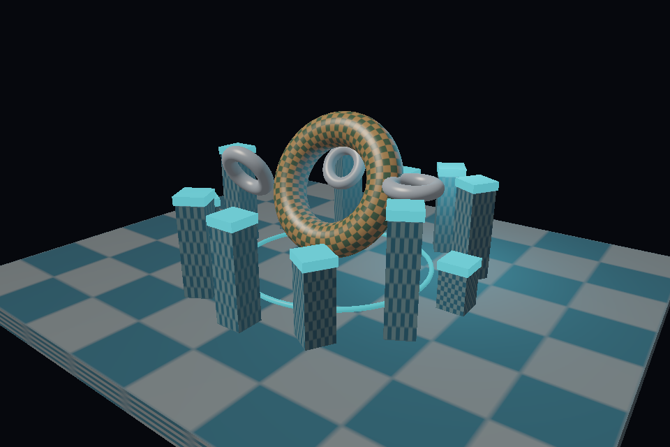
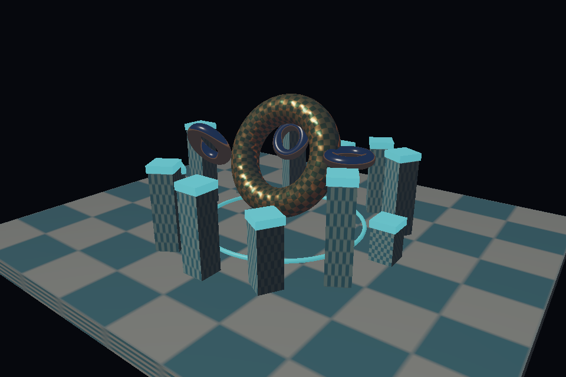
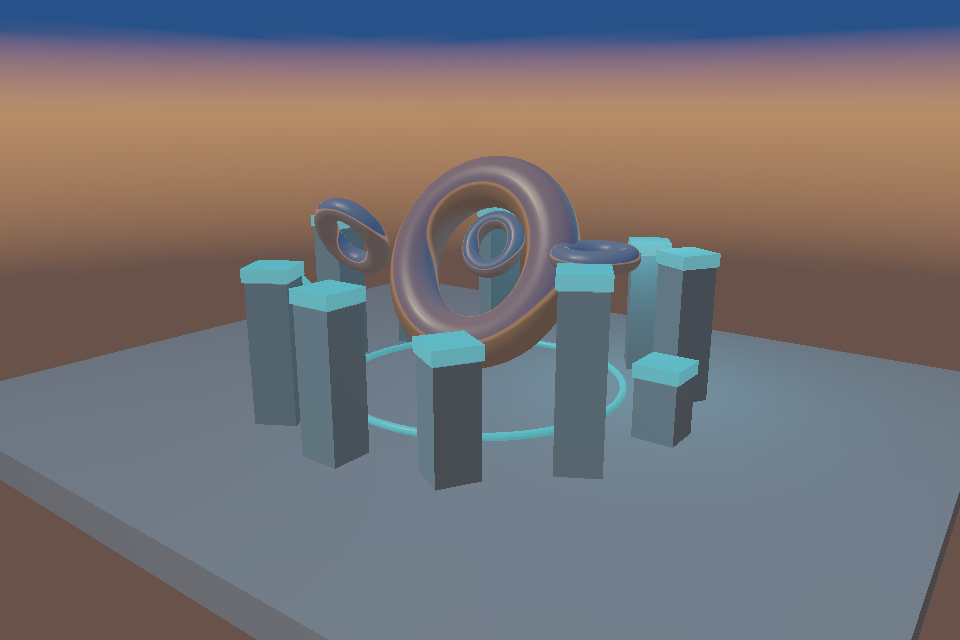
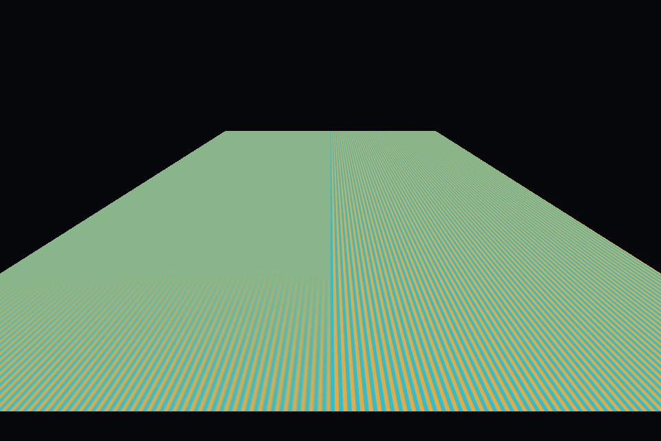
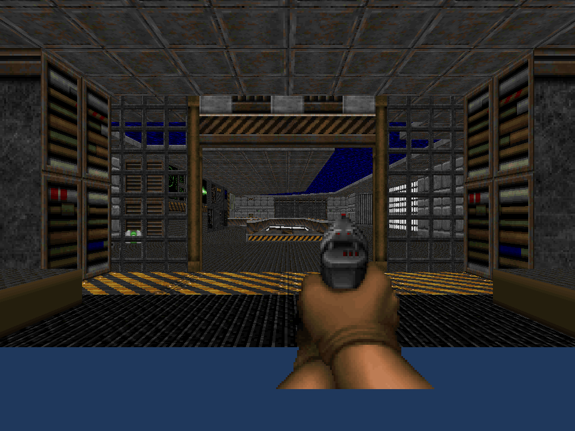

# SILICON

**A GPU built entirely in software.**

[](https://github.com/OthmaneBlial/silicon/actions/workflows/ci.yml)
[](https://github.com/OthmaneBlial/silicon/releases/latest)

[Project site](https://othmaneblial.github.io/silicon/) ·
[Online docs](https://othmaneblial.github.io/silicon/docs.html)

SILICON is an experimental programmable graphics processor implemented in Rust.
Vertex processing, clipping, rasterization, shader execution, textures, depth,
stencil and blending generate scene pixels entirely on the CPU.



*Rendered entirely on the CPU by a GPU I wrote from scratch.*



*Cook-Torrance GGX direct lighting and roughness-selected cube-map reflections. The shader, rasterizer and framebuffer run on the CPU.*



*Six-face cube-map skybox and roughness-selected environment reflections in the native Rust reference scene.*


*The same CPU scene with 4× multisample coverage and a resolved color buffer.*



[Watch the CPU-rendered animation](assets/demos/spirv_showcase.mp4) ·
[Architecture](docs/architecture.md) · [Pipeline](docs/graphics-pipeline.md) ·
[Shader VM](docs/sir.md) · [Compute](docs/compute.md) · [SIMD](docs/simd.md) · [SPIR-V subset](docs/spirv.md) · [Vulkan-like Rust subset](docs/vulkan-like.md) · [Third-party demo](docs/third-party-demo.md) · [Roadmap](docs/roadmap.md)

## Run it

[Download the macOS ARM64 CLI](https://github.com/OthmaneBlial/silicon/releases/latest)
with checksums, or build from source:

```sh
git clone https://github.com/OthmaneBlial/silicon
cd silicon
cargo run --release -p silicon-cli -- run spirv_showcase --threads 4
```

Escape exits, Space pauses, arrows adjust rotation. The window presents an
already rendered CPU framebuffer. On macOS `minifb` uses Metal for that final
pixel presentation; no scene geometry or SILICON shading runs on the host GPU.
Headless rendering requires no graphics device or display.

```sh
cargo run --release -p silicon-cli -- render assets/scenes/showcase.json --output output/scene.png
cargo run --release -p silicon-cli -- render assets/scenes/pbr_showcase.json --backend simd --threads 4 --output output/pbr.png
cargo run --release -p silicon-cli -- render assets/scenes/cubemap_showcase.json --backend simd --threads 4 --output output/cubemap.png
cargo run --release -p silicon-cli -- render cubemap_showcase --samples 4 --backend simd --threads 4 --output output/cubemap-msaa4.png
cargo run --release -p silicon-cli -- render anisotropy_showcase --output output/anisotropy.png
cargo run --release -p silicon-cli -- render showcase --width 640 --height 400 --threads 4
cargo run --release -p silicon-cli -- render stencil --backend simd --threads 4 --output output/stencil.png
cargo run --release --example triangle
cargo run --release --example textured_cube
cargo run --release --example stencil
cargo run --release --example rust_api
cargo run --release --example vulkan_like
cargo run --release --example khronos_hello_triangle
```

Requires Rust 1.95.0 (pinned). macOS ARM64 was run locally, including the window.
Linux x86-64 and ARM64 are CI targets. Window mode on Linux uses X11; the
headless renderer works without X11 at runtime. Other platforms are unverified.

## Use the Rust API

The supported Rust integration surface is [`silicon::api`](docs/rust-api.md).
`Device` creates bounded SPIR-V shader modules, links them into an immutable
pipeline, creates owned typed buffers and command buffers, and submits commands
into an explicit `Renderer`. The renderer owns the output size and framebuffer.
`examples/rust_api.rs` is a runnable end-to-end sample:

```sh
cargo run --release --example rust_api
```

It writes `output/rust_api.png`. Shader modules currently accept SILICON's
documented SPIR-V 1.0 graphics subset; this is not a general-purpose shader
compiler or Vulkan API.

The versioned C ABI is documented in [docs/c-api.md](docs/c-api.md), with its
public header in `crates/silicon-c-api/include/silicon.h`. Its standalone C
smoke test renders and reads back a triangle:

```sh
sh crates/silicon-c-api/scripts/test.sh
```

## First compute kernel

The experimental SIR compute path dispatches a bounded 3D workgroup grid on the
CPU. Each invocation can read matching vec4 elements or use SIR indexed loads
and staged stores into owned storage buffers. Checked offset/stride layouts
address interleaved record fields. SIR also supports per-workgroup shared vec4
memory, synchronized barriers with race detection, and scalar f32 storage
atomics. Run the vector-add proof (4,096 checked outputs):

```sh
cargo run --release --example compute_vector_add
```

Compare scalar and SIMD4 SIR with Rust CPU loops on vector addition and
4×4 matrix-vector transforms:

```sh
cargo run --release --example compute_bench
```

Run the four-invocation workgroup reversal using shared memory and a barrier:

```sh
cargo run --release --example compute_shared_memory
```

Run the cross-workgroup atomic sum and prefix proof (16 verified prefixes):

```sh
cargo run --release --example compute_atomics
```

The bounded contract has no cross-workgroup barriers, integer/vector atomics,
or compute-stage SPIR-V. See the
[compute limits](docs/compute.md).

Phase 68 adds a separate Rust-only [Vulkan-like subset](docs/vulkan-like.md)
with instance/device setup, typed resources, descriptor-like bindings, an
offscreen render pass and synchronous indexed drawing. `examples/vulkan_like.rs`
writes `output/vulkan_like_triangle.png`. It is not a Vulkan loader, ABI, or
conformant implementation.

Phase 69 adapts KhronosGroup's Apache-2.0 Vulkan `hello_triangle` through that
subset. The original positions and RGB colors, adapted vertex shader, and
unchanged upstream fragment shader run through SILICON. See the
[source, license, and adaptation notes](docs/third-party-demo.md).

Phase 70 renders Freedoom E1M1 geometry, textures, all 29 normal-skill enemy
sprites, nine health/ammo pickups, the blue keycard, and the pistol through
SILICON. BSP child bounds cull the horizontal view cone, and per-mesh bounds
test all six frustum planes.
The checked-in start view submits 5,535 triangles across 209 draws: 5,495 map
triangles, 29 enemy billboards, ten pickup billboards, and one weapon billboard.
View-visible map meshes are grouped by material inside coarse depth bands so
nearer ranges reach the depth test first. BSP cells are split at sector boundaries before their validated pieces fill
flat geometry, and the current player leaf remains visible when
the WAD's child bounds would cull it.
The interactive prototype adds first-person movement, basic collision, player
hitscan, health and ammo pickups, Doom-timed enemy idle and chance-based pain
poses, sight-based wake-up with a 100-tic target timeout, sector-portal enemy
pursuit around blocked corridors, pistol-noise alerts that wake enemies through
open sectors even when a shot misses, melee attacks, line-of-sight hitscan for
humans and shotgunners, and imp fireballs. The player can trigger E1M1's WAD
special-1 doors with `E` and use the exit line; ordinary doors raise, wait, and
close with matching map geometry and collision. Its special-117 use door raises
at four times normal speed, then closes after the same wait. Crossing a WAD
special-2 line opens sectors with its tag and leaves them open. The exit reports `EXITED`
without loading another map. The player can cross a special-88 line or use a
special-62 line to move its tagged platform down, wait, then return it to its
starting height. The special-23 use line lowers its three tagged floors to
their lowest neighboring height once. The blue keycard can be collected to
open special-26 blue-locked doors. Other locked-door types, other
crossing-triggered specials, and level progression remain unsupported.
E1M1's four special-9 sectors add to a once-per-sector secret counter in the
window title. Its three special-7 nukage sectors deal 5 HP every 32 game tics
spent on them.
Enemies cycle four WAD walk frames,
play attack and death poses, leave corpses,
and select among eight camera-relative sprite views; fireballs show WAD impact
frames. It remains
a limited E1M1 gameplay slice, not a complete Doom game;
BSP wall occlusion, per-column portal clipping, and broader game rules remain. The [WAD source,
controls, screenshots, license, and limits](docs/freedoom.md) are documented.
The Freedoom WAD stays external.
An [enemy sprite verification frame](assets/screenshots/freedoom_e1m1_enemy.png)
shows a real WAD actor through the same pipeline from a temporary start-only
capture fixture.



*Static E1M1 view from the player start; this camera does not show an enemy. WAD flats, walls, and gameplay sprites use SILICON's texture and shader paths.*

## Programmable, observable, reproducible

The `spirv_showcase` executes ordinary GLSL vertex/fragment shaders through
SPIR-V → SIR → CPU commands: a real original OBJ sculpture,
filtered textures, smooth normals, a normal matrix, Lambert/Blinn-Phong lighting,
a directional light, a point light and fog. Its 30 draws submit 12,588 triangles.
The native `showcase` remains an independent Rust shader reference. The `shader_cube` executes **both stages**
through SILICON's validated SIR bytecode interpreter and owned GPU-like commands.
The `spirv_cube` loads ordinary externally compiled GLSL vertex/fragment shaders,
validates a strict SPIR-V 1.0 subset and translates it into the same CPU VM.
The `spirv_cutout` executes nested GLSL branches, conditional texture sampling,
Phi/local reconvergence, early return and fragment discard.
The `shadow_showcase` renders a CPU depth pass for the same OBJ scene and samples
its depth texture from an ordinary GLSL fragment shader through explicit-LOD SPIR-V.
The `pbr_showcase` runs a GLSL metallic/roughness Cook-Torrance GGX shader through
SPIR-V and the CPU SIR pipeline. Direct lighting, a procedural tangent-space
normal map, and roughness-selected `samplerCube` reflections all run on the CPU.
The environment term is a compact mip approximation, not split-sum IBL.
The `cubemap_showcase` samples a six-face `CubeMap` for a skybox and reflected
environment color in a native Rust shader. Material roughness selects a
box-filtered mip level as a compact reflection-blur approximation. The GLSL
path supports explicit `textureLod` and isotropic implicit sampling of an
unmodified vec3 direction varying at fragment location 1.
The `stencil` scene uses a circular portal mask for both a textured cube and a
translucent overlay.
The renderer also supports deterministic 2× and 4× multisampling with
per-sample color, depth and stencil attachments; `--samples 1` keeps the
single-sample default.
Native Rust fragment shaders can opt into anisotropic texture sampling with
actual UV derivatives and a bounded 1×–16× tap count. `anisotropy_showcase`
compares trilinear filtering on the left with 16× anisotropy on the right.

```sh
cargo run --release -p silicon-cli -- run spirv_showcase --threads 4
cargo run --release -p silicon-cli -- run spirv_cutout --backend simd
cargo run --release -p silicon-cli -- render shadow_showcase --backend simd --threads 4 --output output/shadows.png
cargo run --release -p silicon-cli -- run spirv_cube
cargo run --release -p silicon-cli -- inspect-shader assets/shaders/textured.frag.spv
cargo run --release -p silicon-cli -- render-shaders assets/shaders/textured.vert.spv assets/shaders/textured.frag.spv --output output/glsl.png
```

See the [exact SPIR-V subset and binding contract](docs/spirv.md).
External compiler tools are needed only to regenerate shader fixtures.

```sh
cargo run --release -p silicon-cli -- render spirv_showcase --capture output/frame.silicon
cargo run --release -p silicon-cli -- inspect output/frame.silicon
cargo run --release -p silicon-cli -- replay output/frame.silicon --output output/replay.png
cargo run --release -p silicon-cli -- debug-pixel spirv_showcase --pixel 480,320
```

Captures embed actual buffers, textures, uniforms, pipeline state, commands and
shader bytecode. Replays compare byte-for-byte to the original framebuffer.
Pixel traces expose primitives, barycentrics, varying values, depth rejection,
shader instructions, sampled values and final color. Native closures currently
cannot be captured; recorded SIR commands, including translated SPIR-V, can.


## What works

| Stage | Implemented |
| --- | --- |
| API | Supported Rust API v1, versioned C ABI v1, and Vulkan-like Rust subset; synchronous command submission and CPU framebuffer readback |
| Memory | Owned typed vertex/index/uniform buffers; reference-counted command lifetimes |
| Geometry | Indexed/non-indexed triangles, homogeneous six-plane clipping, CW/CCW culling |
| Raster | Pixel-center top-left coverage, 8-bit subpixel precision, 16×16 tiles |
| Interpolation | Colors/UV/normals/custom vec4 varyings, perspective reconstruction, affine NDC depth |
| Shading | Native Lambert/Blinn reference; GLSL Blinn and Cook-Torrance GGX metallic/roughness through SPIR-V |
| Attachments | RGBA8/BGRA8, depth with 8 compare modes, stencil masks/operations |
| Texturing | RGBA8/RGB8/R8 2D, array and 3D textures; depth textures and cube maps; nearest/bilinear/trilinear, clamp/repeat/mirror and mip generation/LOD |
| Shaders | Rust closures; bounded SIR VM; strict SPIR-V 1.0 → SIR; nested selections, Phi, early return/discard |
| Compute | Experimental SIR dispatch, 3D IDs, up to 12 indexed read buffers, checked record layouts, staged indexed writes, 64 KiB per-workgroup shared memory and barriers, and scalar f32 storage atomics; divergent barriers and shared-memory races fail safely; synchronized kernels use the scalar scheduler |
| Output merger | Replace, source alpha, additive and multiplicative blending; color/depth write enables |
| Execution | Scalar reference, optional SIMD coverage4 and NEON/SSE four-fragment SIR, disjoint worker bands |
| Tools | Headless rendering, native window, frame capture/replay/inspection, pixel trace, profiling, pipeline-cache probe, cargo-fuzz targets |

The opt-in SIMD path processes four coverage lanes and runs recorded SIR fragment
shaders in masked groups of four. Arithmetic spans fragments; vertex shaders,
native Rust closures, power and texture callbacks remain scalar. Tiled coverage
is implemented; full primitive binning and persistent worker pools are future work.
Parallel bands repeat geometry setup. Tests compare exact scalar/SIMD framebuffer
bytes and bitwise VM outputs/traces for all sixteen lane masks. See [SIMD details](docs/simd.md).

## Measure it

```sh
cargo run --release -p silicon-cli -- benchmark showcase --frames 30 --backend scalar --threads 1
cargo run --release -p silicon-cli -- benchmark spirv_showcase --frames 30 --backend simd --threads 4 --report output/frames.json
cargo run --release -p silicon-cli -- profile spirv_showcase --threads 4
cargo run --release -p silicon-cli -- pipeline-cache assets/shaders/textured.vert.spv assets/shaders/textured.frag.spv
python3 benchmarks/run.py --frames 30
```

Benchmarks include frame rendering, exclude image encoding/window presentation,
and report measured median/p95 and throughput. `--report` retains chronological
frame times, backend/worker configuration, actual shader packet occupancy and executed
instruction/sample/discard counts. Profile additionally instruments
fragment shader time; per-worker accumulated stage times can exceed wall time.
See [performance notes](docs/performance.md) for actual host measurements and
limits. The animation uses offline frames encoded at 24 fps; it is not an FPS
claim. No physical-GPU performance comparisons are made.

## Check it

```sh
cargo fmt --all --check
cargo check --workspace --all-targets
cargo test --workspace
cargo clippy --workspace --all-targets -- -D warnings
```

Tests cover math, framebuffer bytes, shared-edge ownership, clipping, depth and
discard, perspective interpolation, texture addressing/mips, OBJ bounds, stencil,
shader validation/tracing, GLSL/SPIR-V translation and malformed modules,
command validation, exact capture replay, an approved
PNG and scalar/SIMD/parallel equivalence. Golden changes require an explicit
`cargo run --release --example shader_cube -- --bless` and image review.

## Boundaries

This is a research software GPU, not a conformant driver. SPIR-V support is
a narrow graphics subset with acyclic structured selections with a fixed binding contract. **General
SPIR-V/GLSL compatibility, WGSL, conformant Vulkan/OpenGL drivers, general compute,
compute-stage SPIR-V, JIT, and full-game compatibility are not implemented.** Phase 70 is a limited
Freedoom E1M1 gameplay slice. The small Rust Vulkan-like subset is documented
separately; it is not binary compatible with Vulkan. Do not infer support from the long-term roadmap. MSAA and
GLSL shadow-map samples are implemented within the documented renderer subset. Multiple color
attachments and asynchronous queues are also future work.

No Mesa, LLVMpipe, SwiftShader, ANGLE, wgpu backend or existing rasterizer
produces these pixels. Image encoding and native window presentation are the
only graphics-adjacent external components. See [input safety](docs/security.md)
for bounds and limitations; this is not a hardened hostile-shader sandbox.

Contributions should bring a small reproducer, a correctness check and an actual
render or measurement. Improve the pipeline rather than special-case an asset.

Apache-2.0.
