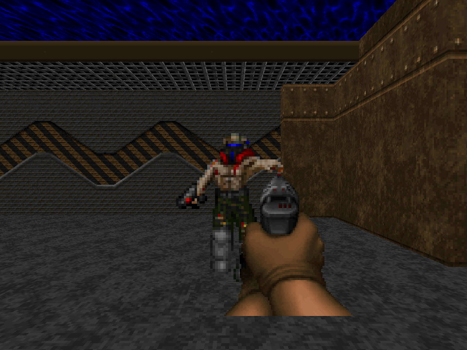

# Freedoom E1M1 gameplay through SILICON

The Phase 70 sample reads `E1M1` from an external Freedoom Phase 1 IWAD. It
builds BSP-leaf floor and ceiling polygons, one-sided walls, and two-sided upper
and lower wall tiers from the WAD's classic map lumps. It palette-decodes the
64×64 floor and ceiling flats and composes wall textures from
`TEXTURE1`/`TEXTURE2`, `PNAMES`, and classic patch columns, using `PLAYPAL` for
both. Two-sided middle textures keep unpainted patch pixels transparent and
render as depth-tested cutouts through the existing SIR discard shader.
Sidedef offsets and the upper/lower or masked-middle pegging flags set wall
UVs. Sector light levels tint the sampled pixels. Geometry, textures,
billboards, transform uniforms, and GLSL SPIR-V shaders are submitted to
SILICON's CPU renderer; no game framebuffer or other renderer is copied.

Download [Freedoom 0.13.0](https://github.com/freedoom/freedoom/releases/tag/v0.13.0)
at upstream commit
[`cfb8644b1a8dc7d7d2177e6a892ccaa2922bdaae`](https://github.com/freedoom/freedoom/commit/cfb8644b1a8dc7d7d2177e6a892ccaa2922bdaae),
extract `freedoom1.wad`, then run:

```sh
cargo run --release --example freedoom_map -- /path/to/freedoom1.wad
cargo run --release --example freedoom_map -- /path/to/freedoom1.wad --interactive
```

The first command writes `output/freedoom_map.png`. The interactive view uses
WASD to move and strafe, arrow keys to turn, Shift to run, Space to fire, and
Escape to exit. Each frame submits the scene again through SILICON. Movement
stays inside a BSP-leaf floor, keeps a 16-unit margin from one-sided or
explicitly blocking lines, limits steps to 24 units, and requires 56 units of
ceiling clearance. In interactive mode, the WAD's stim packs, medikits, clips,
and ammo boxes render as cutout billboards and can be collected within 24 units
when health or pistol ammo is below its 100 or 200 cap. The player starts with
50 pistol rounds.

The combat slice loads four normal-skill enemy types from WAD things and their
classic `A1`–`D1` walk and `E1`–`G1` attack sprite patches: former humans (20
health), shotgunners (30), imps (60), and demons (150), including their
species-specific death patches. Moving enemies cycle their walk frames, play
three-frame attack poses and non-gib death sequences, and choose among eight
camera-relative views using Doom's state durations; killed enemies remain as
their final corpse frame. Paired Freedoom patches are horizontally flipped
where Doom does so. Cutout billboards use a SILICON fragment shader. Space
fires a 20-damage hitscan with a 0.35-second cooldown; pistol ammo caps at 200.
Enemies chase within 640 map units and deal 8 melee damage within 48 units, at
most once every 0.85 seconds. Former humans fire 3-damage hitscan attacks and
shotgunners fire 6-damage hitscan attacks within 512 units, at most once every
1.4 seconds and only with clear sight past blocking lines. Damage and projectile
launch happen as soon as the cooldown expires; the pose plays afterward, with
no attack windup or aim spread. The window title
reports health, ammo, pickups, kills, draw calls, and triangles. Imps launch a
straight BAL1A0 fireball within 512 units when they have clear sight;
it travels at 180 units per second, lasts up to 3 seconds, and deals 8 damage
on contact, with a 2-second launch cooldown. On wall or player impact it plays
BAL1C0–BAL1E0 for six Doom tics each. This prototype omits vertical aiming and
motion. The WAD
pistol's PISGA0 patch is the idle camera-aligned billboard; firing briefly uses
its PISGC0 patch for 0.16 seconds. Both weapon poses use SILICON's cutout shader
and draw pipeline.

Freedoom 0.13.0 E1M1 has 29 normal-skill enemy placements. The sample parses
the WAD node partition tree to locate each thing's subsector and sector and to
cull map subsectors whose node bounds lie wholly outside the horizontal view
cone and near/far interval. Traversal visits child nodes near-to-far; each
static material mesh also uses its vertex bounds to reject geometry outside any
of the six camera-frustum planes, then surviving geometry is batched by
texture and cutout mode. This does not implement Doom's BSP wall occlusion or
per-column portal clipping. At the checked-in 960×720 start view, 567 of 682
subsectors remain in the horizontal BSP view and SILICON submits 4,046
triangles across 172 draws, including the newly rendered masked middle
textures. Earlier opaque-only counts were 3,896 triangles and 164 draws for
this view. The screenshot shows the player start,
pistol, and a medikit; enemies are outside that camera view. A temporary WAD
with only its player start moved was used to capture an enemy sprite in view;
that test fixture is not included.

This is a limited gameplay prototype, not Doom's complete player physics or
game rules. Frustum bounds reject only map geometry outside the view; enemy
idle/pain/gib states, projectile vertical motion, keys, exits, other weapons and
their ammunition, full weapon animation beyond the brief idle/fire pose, and
sound remain unimplemented.
`F_SKY1` ceilings show the clear color. The checked-in
[`E1M1 screenshot`](../assets/screenshots/freedoom_e1m1.png) was rendered from
the unmodified release WAD. The WAD itself is not included. The release archive
checksum is SHA-256 `3f9b264f3e3ce503b4fb7f6bdcb1f419d93c7b546f4df3e874dd878db9688f59`.



*Sprite verification view from the same WAD with only the player start moved into the enemy corridor; the temporary WAD is not included.*

Freedoom's three-clause BSD notice and contributor list accompany this derived
sample in [`assets/licenses/FREEDOOM-COPYING.txt`](../assets/licenses/FREEDOOM-COPYING.txt)
and [`assets/licenses/FREEDOOM-CREDITS.txt`](../assets/licenses/FREEDOOM-CREDITS.txt).
The upstream project and contributors do not endorse SILICON. See the
[Freedoom 0.13.0 release](https://github.com/freedoom/freedoom/releases/tag/v0.13.0),
[license source](https://raw.githubusercontent.com/freedoom/freedoom/v0.13.0/COPYING.adoc),
[id Software's item and ammo handling](https://github.com/id-Software/DOOM/blob/master/linuxdoom-1.10/p_inter.c),
and id Software's [WAD](https://github.com/id-Software/DOOM/blob/master/linuxdoom-1.10/w_wad.h),
[map and BSP record](https://github.com/id-Software/DOOM/blob/master/linuxdoom-1.10/doomdata.h),
[BSP point traversal](https://github.com/id-Software/DOOM/blob/master/linuxdoom-1.10/r_main.c),
and [wall rendering](https://github.com/id-Software/DOOM/blob/master/linuxdoom-1.10/r_segs.c)
references. The walk frame sequence and durations follow id Software's
[monster states](https://github.com/id-Software/DOOM/blob/master/linuxdoom-1.10/info.c),
[sprite view selection](https://github.com/id-Software/DOOM/blob/master/linuxdoom-1.10/r_things.c),
and [35-tic game clock](https://github.com/id-Software/DOOM/blob/master/linuxdoom-1.10/doomdef.h).
