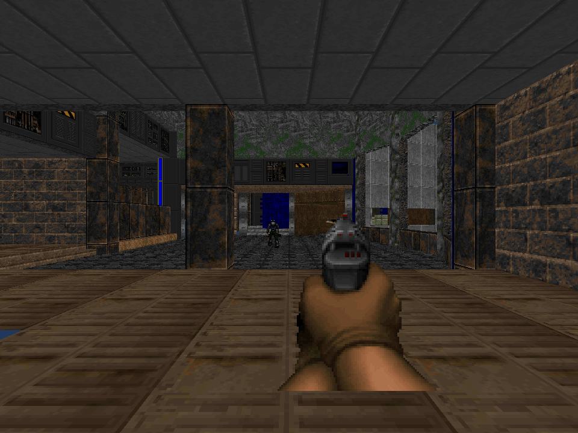
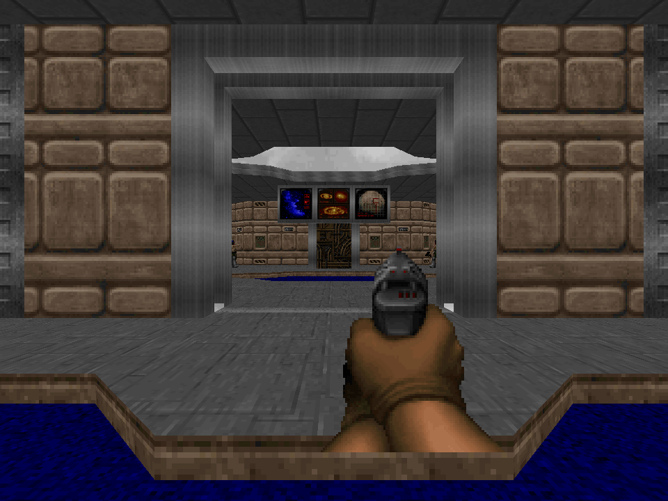

# Freedoom E1M1 gameplay through SILICON

The Phase 70 sample reads `E1M1` from an external Freedoom Phase 1 IWAD. It
builds BSP-leaf floor and ceiling polygons, one-sided walls, and two-sided upper
and lower wall tiers from the WAD's classic map lumps. It palette-decodes the
64×64 floor and ceiling flats and composes wall textures from
`TEXTURE1`/`TEXTURE2`, `PNAMES`, and classic patch columns, using `PLAYPAL` for
both. Two-sided middle textures keep unpainted patch pixels transparent and
render as depth-tested cutouts through the existing SIR discard shader.
BSP cells are split at linedef boundaries before sector-valid pieces supply flat
geometry, including leaves whose seg endpoints do not enclose an area. The
seg-endpoint hull remains a fallback when no BSP piece validates.
Sidedef offsets and the upper/lower or masked-middle pegging flags set wall
UVs. Sector light levels tint the sampled pixels. Geometry, textures,
billboards, transform uniforms, and GLSL SPIR-V shaders are submitted to
SILICON's CPU renderer; no game framebuffer or other renderer is copied.

Download [Freedoom 0.13.0](https://github.com/freedoom/freedoom/releases/tag/v0.13.0)
at upstream commit
[`cfb8644b1a8dc7d7d2177e6a892ccaa2922bdaae`](https://github.com/freedoom/freedoom/commit/cfb8644b1a8dc7d7d2177e6a892ccaa2922bdaae),
extract `freedoom1.wad`, then run:

```sh
cargo run --release --example freedoom_map -- /path/to/freedoom1.wad
cargo run --release --example freedoom_map -- /path/to/freedoom1.wad --interactive
cargo run --release --example freedoom_map -- /path/to/freedoom1.wad --map E1M2 /tmp/freedoom_e1m2.png
```

Map selection defaults to E1M1; `--map` accepts another marker in the WAD, such
as E1M2, for either rendering or interactive play. Each map uses its own
player-1 start and the same SILICON pipeline. Special-11 exits load the next
episode map when its marker exists. Special-51 secret exits load that episode's
M9, whose ordinary exit returns to E1M4, E2M6, E3M7, or E4M3, respectively.
Health, ammo, keys, and armor carry forward while map-local counters reset. Episode-
ending map exits stop at `EXITED` because the prototype has no finale. These
routes follow id Software's
[`G_DoCompleted`](https://github.com/id-Software/DOOM/blob/master/linuxdoom-1.10/g_game.c)
and [`P_UseSpecialLine`](https://github.com/id-Software/DOOM/blob/master/linuxdoom-1.10/p_switch.c).
The E1M2 capture below records the
sector-clipped BSP-cell pass with its episode sky: 8,059 triangles across 364
draws and 804 of 1,104 horizontal leaves. The sky texture fills the previously
clear opening near the right edge. Visual completeness beyond E1M2 remains in
progress. The first command writes
`output/freedoom_map.png`. The interactive view uses
WASD to move and strafe, arrow keys to turn, Shift to run, Space to fire, `E`
to open ordinary doors, operate manual lifts, or use the exit, and Escape to
exit. Every frame submits the scene again through SILICON; movement stays inside
a BSP-leaf floor, keeps a 16-unit margin from one-sided or explicitly blocking
lines, limits steps to 24 units, and requires 56 units of ceiling clearance.
WAD stim packs, medikits, health bonuses, soul spheres, radiation suits, clips,
ammo boxes, green/blue armor, armor bonuses, and keys render as cutout
billboards. Pickups require clear sight and a 24-unit range. Health/ammo and
armor upgrades stay on the map when they cannot improve the player's inventory;
repeated keys, health bonuses, soul spheres, and armor bonuses are consumed on
contact. Health pickups cap at 100; bonuses and soul spheres can raise health to
200. Armor and pistol ammo cap at 200. Green armor absorbs one third of damage,
blue armor one half, and armor bonuses add one point up to 200. These
rules follow id Software's [`P_GiveBody`, `P_GiveArmor`,
`P_TouchSpecialThing`, and `P_DamageMobj`](https://github.com/id-Software/DOOM/blob/master/linuxdoom-1.10/p_inter.c).
Radiation suits set or refresh a 60-second timer and prevent sector-7 nukage
damage while active, following id Software's [`P_GivePower`](https://github.com/id-Software/DOOM/blob/master/linuxdoom-1.10/p_inter.c)
and [`P_PlayerInSpecialSector`](https://github.com/id-Software/DOOM/blob/master/linuxdoom-1.10/p_spec.c).
The player starts with
50 pistol rounds. Press `E` within 64 units from the front of a special-1 door
to raise its back sector at 70 units per second, wait 150 tics (about 4.3
seconds), then close it. If the player or a living enemy is in the sector, the
door reverses and opens again. The ceiling geometry and collision update while
it moves. Press `E` from the front of E1M1's one-sided special-11 exit line to
load E1M2 when its WAD marker exists, as described above. A special-51 line
similarly loads the episode's M9 secret map when present.
The WAD's single special-117 use door follows the same wait-and-close behavior
at 280 units per second, four times the normal door speed, as in id Software's
[`EV_VerticalDoor`](https://github.com/id-Software/DOOM/blob/master/linuxdoom-1.10/p_doors.c).
Walking across a special-2 line opens each sector with its tag and leaves the
door open. The release WAD has six such lines for tags 5 and 6, targeting closed
sectors 77 and 145. Trigger lines activate only after accepted player movement;
the one-shot special clears once crossed. This follows id Software's
[`P_CrossSpecialLine` open-door action](https://github.com/id-Software/DOOM/blob/master/linuxdoom-1.10/p_spec.c).
Player or living-enemy crossings of repeatable special-88 lines trigger the tagged platform to
descend at 140 units per second to the lowest neighboring floor, wait 105 tics
(3 seconds), then return to its starting height. The release WAD has five such
lines for tags 1 and 2, targeting sectors 98 and 103. Platform floors and their
collision and rendered geometry move together. The speed and timing follow
id Software's [`T_PlatRaise` and `downWaitUpStay` action](https://github.com/id-Software/DOOM/blob/master/linuxdoom-1.10/p_plats.c).
Press `E` from the front of a special-62 line to activate the same repeatable
down-wait-up action. E1M1 has four such lines for tags 1 and 2, targeting the
same sectors 98 and 103. The original engine routes special 62 to the same
`downWaitUpStay` platform action as special 88, but through the use control
instead of a walk crossing, as shown in id Software's
[`P_UseSpecialLine`](https://github.com/id-Software/DOOM/blob/master/linuxdoom-1.10/p_switch.c).
Press `E` at the front of the one-shot special-23 line to lower its tagged
sectors to their lowest neighboring floor and leave them there. The WAD's one
tag-3 line targets sectors 76, 126, and 129; their floor heights lower from
272, 264, and 264 to 136, 144, and 136 at 35 units per second. It follows
id Software's
[`P_UseSpecialLine` and `lowerFloorToLowest` action](https://github.com/id-Software/DOOM/blob/master/linuxdoom-1.10/p_switch.c)
and [`EV_DoFloor`](https://github.com/id-Software/DOOM/blob/master/linuxdoom-1.10/p_floor.c).
Collect a matching keycard or skull to open special-26 blue, special-27 yellow,
or special-28 red doors. The prototype recognizes all six card/skull map-thing
types and renders their WAD sprites; cards and skulls grant the same color key.
E1M1 has one blue-card thing (type 5), drawn with `BKEYA0`; the original engine
checks for the blue card or skull before opening these doors in
[`EV_VerticalDoor`](https://github.com/id-Software/DOOM/blob/master/linuxdoom-1.10/p_doors.c).
Use-only special 31 opens a manual door and leaves it open. Specials 32, 33,
and 34 do the same for blue, red, and yellow locks; they require the matching
card or skull and clear the one-shot line after activation. The open-stay and
key mapping follow id Software's [`EV_VerticalDoor`](https://github.com/id-Software/DOOM/blob/master/linuxdoom-1.10/p_doors.c)
and [`P_UseSpecialLine`](https://github.com/id-Software/DOOM/blob/master/linuxdoom-1.10/p_switch.c).
Other locked-door action variants, enemy-triggered platform actions besides
special 88, and other line specials remain unsupported.

E1M1 contains four secret sectors (sector special 9). Entering one increments
the secret counter in the window title once and clears its secret flag, matching
the original engine's
[`P_PlayerInSpecialSector`](https://github.com/id-Software/DOOM/blob/master/linuxdoom-1.10/p_spec.c).
The WAD also has three sector-special-7 nukage sectors. They deal 5 HP every
32 game tics spent on the floor, following the original `P_PlayerInSpecialSector`
damage rule without suit mitigation.
Three sector-special-1 lights blink with randomized bright and dark intervals;
six sector-special-12 lights strobe together, alternating one bright tic, 35
dark tics, and five bright tics. Both use adjacent-sector minimum light levels
and rebuild the scene through SILICON when their levels change, following
id Software's [`T_LightFlash`, `T_StrobeFlash`, and spawn actions](https://raw.githubusercontent.com/id-Software/DOOM/master/linuxdoom-1.10/p_lights.c).
Blink timing uses the sample's seeded RNG rather than Doom's shared random table.

The combat slice loads four normal-skill enemy types from WAD things and their
classic `A1`–`D1` walk and `E1`–`G1` attack sprite patches: former humans (20
health), shotgunners (30), imps (60), and demons (150), including their
species-specific death patches. Moving enemies cycle their walk frames, play
three-frame attack poses and non-gib death sequences, and choose among eight
camera-relative views using Doom's state durations; killed enemies remain as
their final corpse frame. Paired Freedoom patches are horizontally flipped
where Doom does so. Cutout billboards use a SILICON fragment shader. Space
fires a 20-damage hitscan with a 0.35-second cooldown; pistol ammo caps at 200.
Every fired shot alerts living enemies through open two-sided sectors, even
when it misses, crossing at most one sound-blocking linedef. This models Doom's
pistol noise alert and recursive sector sound flood, not every sound event.
Awake enemies deal 8 melee damage within 48 units, at most once every 0.85
seconds. Former humans fire 3-damage hitscan attacks and
shotgunners fire 6-damage hitscan attacks within 512 units, at most once every
1.4 seconds and only with clear sight past blocking lines. Damage and projectile
launch happen as soon as the cooldown expires; the pose plays afterward, with
no attack windup or aim spread. A surviving pistol hit rolls against Doom's
pain chances: 200/256 for imps and former humans, 180/256 for demons, and
170/256 for shotgunners. Successful rolls show the pain sprite for four tics
on imps and demons or six tics on former humans and shotgunners. A deterministic
local xorshift supplies rolls, so probabilities match but Doom's global random
sequence does not. The window title reports health, armor points and class,
ammo, pickups, kills, draw calls, and triangles. Melee, ranged, fireball, and
nukage damage all use the same armor calculation. Imps launch a
3D straight BAL1A0 fireball aimed at the player's body midpoint within 512
units when they have clear sight. It travels at 180 units per second, lasts up
to 3 seconds, and deals 8 damage on contact when the projectile height overlaps
the player, with a 2-second launch cooldown. Its z position follows a straight
line between the shooter and player's floor-based body midpoints. On wall or
player impact it plays BAL1C0–BAL1E0 for six Doom tics each. The WAD
pistol's PISGA0 patch is the idle camera-aligned billboard; firing briefly uses
its PISGC0 patch for 0.16 seconds. Both weapon poses use SILICON's cutout shader
and draw pipeline. Enemies cycle their A/B ten-tic stand states while unaware.
They wake within 640 map units on clear sight or when hit; sight refreshes a
100-tic target timeout, during which they pursue through lost sight. All enemy
attacks require clear sight. When both positions resolve to BSP sectors, a
breadth-first route over walkable two-sided linedefs selects the next portal;
the opening must fit the actor and allow an upward step of at most 24 units. The
router samples portal points and picks one with a clear 16-unit swept margin
from blocking lines, allowing simple pursuit around walls. If map data yields
no waypoint, direct pursuit remains the fallback. This sector graph is not
Doom's full actor navigation; full target-selection rules and other sound
events remain unimplemented. See id Software's [`P_NoiseAlert` and
`P_RecursiveSound`](https://github.com/id-Software/DOOM/blob/master/linuxdoom-1.10/p_enemy.c)
and [`P_FireWeapon`](https://github.com/id-Software/DOOM/blob/master/linuxdoom-1.10/p_pspr.c)
for the original sector sound flood and pistol alert call.

Freedoom 0.13.0 E1M1 has 29 normal-skill enemy placements. The sample parses
the WAD node partition tree to locate each thing's subsector and sector and to
cull map subsectors whose node bounds lie wholly outside the horizontal view
cone and near/far interval. Traversal visits child nodes near-to-far; leaves whose
mesh bounds exceed the intersected WAD bounds are tested separately. The player's
leaf is always retained. Each static
material mesh also uses its vertex bounds to reject geometry outside any
of the six camera-frustum planes, then surviving geometry is batched by
texture and cutout mode within coarse 2,048-unit view-depth bands, so nearby
bands reach the depth test first. This can reject hidden fragments before the
fragment shader runs, while preserving the framebuffer; it does not implement
Doom's BSP wall occlusion or per-column portal clipping. At the checked-in
960×720 start view, 570 of 682 subsectors remain in the horizontal BSP view and
SILICON submits 5,711 triangles across 259 draws. The checked-in camera view
contains 59 visible pickup billboards: nine health/ammo items, 30 health
bonuses, one blue card, one green armor, and 18 armor bonuses; the armor items
do not appear in that capture.
The sky draw follows opaque map batches with `LessEqual` depth testing and depth
writes disabled, so the rasterizer rejects sky samples behind nearer map
geometry before it runs the sky shader. The panorama sits 64 map units inside
the 8,192-unit far clip plane to leave room for f32 transform rounding. Five
release renders on Apple M2 measured a median process CPU time of 0.60 s;
the E1M1 output is byte-identical to the preceding capture. The earlier
depth-band comparison measured 0.62 s against 0.69 s at its predecessor. These
fixed-pose measurements are not engine-wide benchmarks. Earlier opaque-only counts were
3,896 triangles and 164 draws for this view. The screenshot shows the player
start, pistol, and a medikit; enemies and the newly supported armor items are
outside that camera view. A temporary
WAD with only its player start moved was used to capture an enemy sprite in view;
that test fixture is not included.

This is a limited gameplay prototype, not Doom's complete player physics or
game rules. Frustum bounds reject only map geometry outside the view; enemy
gib states, Doom's detailed actor navigation, other sound events, other
power-ups, locked-door action variants, crossing specials other than 2 and 88,
other use specials, episode finales, other weapons and their ammunition, and full weapon animation
beyond the brief idle/fire pose remain unimplemented.
`F_SKY1` ceilings use the map's episode sky texture, sampled by view angle. The
checked-in [`E1M1 screenshot`](../assets/screenshots/freedoom_e1m1.png) was
rendered from the unmodified release WAD. The WAD itself is not included. The release archive
checksum is SHA-256 `3f9b264f3e3ce503b4fb7f6bdcb1f419d93c7b546f4df3e874dd878db9688f59`.




*E1M2 capture after splitting BSP cells at sector boundaries and adding the WAD sky texture.*



*E1M4 start view: 8,912 triangles across 379 draws in 829 of 1,202 horizontal leaves.*

*Sprite verification view from the same WAD with only the player start moved into the enemy corridor; the temporary WAD is not included.*

Freedoom's three-clause BSD notice and contributor list accompany this derived
sample in [`assets/licenses/FREEDOOM-COPYING.txt`](../assets/licenses/FREEDOOM-COPYING.txt)
and [`assets/licenses/FREEDOOM-CREDITS.txt`](../assets/licenses/FREEDOOM-CREDITS.txt).
The upstream project and contributors do not endorse SILICON. See the
[Freedoom 0.13.0 release](https://github.com/freedoom/freedoom/releases/tag/v0.13.0),
[license source](https://raw.githubusercontent.com/freedoom/freedoom/v0.13.0/COPYING.adoc),
[id Software's item, ammo, damage and target-threshold handling](https://github.com/id-Software/DOOM/blob/master/linuxdoom-1.10/p_inter.c),
[64-unit linedef use tracing](https://github.com/id-Software/DOOM/blob/master/linuxdoom-1.10/p_map.c),
[manual door height, speed, and wait handling](https://github.com/id-Software/DOOM/blob/master/linuxdoom-1.10/p_doors.c),
[special 11's level-exit action](https://github.com/id-Software/DOOM/blob/master/linuxdoom-1.10/p_switch.c),
[100-tic target threshold](https://github.com/id-Software/DOOM/blob/master/linuxdoom-1.10/p_local.h),
and id Software's [WAD](https://github.com/id-Software/DOOM/blob/master/linuxdoom-1.10/w_wad.h),
[map and BSP record](https://github.com/id-Software/DOOM/blob/master/linuxdoom-1.10/doomdata.h),
[BSP point traversal](https://github.com/id-Software/DOOM/blob/master/linuxdoom-1.10/r_main.c),
and [wall rendering](https://github.com/id-Software/DOOM/blob/master/linuxdoom-1.10/r_segs.c)
references. The walk frame sequence and durations follow id Software's
[monster states](https://github.com/id-Software/DOOM/blob/master/linuxdoom-1.10/info.c),
[sprite view selection](https://github.com/id-Software/DOOM/blob/master/linuxdoom-1.10/r_things.c),
and [35-tic game clock](https://github.com/id-Software/DOOM/blob/master/linuxdoom-1.10/doomdef.h).
