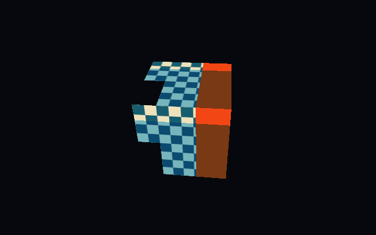

# SPIR-V → SIR → CPU pixels

SILICON implements a **strict SPIR-V 1.0 graphics subset** plus a narrow
compute-stage storage-buffer subset, implemented directly in Rust. It parses
binary words, validates the supported module and translates it into SIR. Vertex,
fragment and supported compute programs execute through the existing CPU VM.
No external compiler or GPU is called at runtime. This is not SPIR-V conformance,
a Vulkan driver, or general GLSL support.

## Reproduce with ordinary GLSL

The committed original GLSL sources and their `.spv` fixtures are in
[`assets/shaders`](https://github.com/OthmaneBlial/silicon/tree/main/assets/shaders). They were compiled with Khronos glslang
16.6.0 and checked with SPIRV-Tools 1.4.357.0. These tools are needed only to
recompile fixtures, not to build, test or run SILICON:

```sh
for shader in textured.vert textured.frag arithmetic.frag negate.frag lit.vert lit.frag shadow.frag pbr.vert pbr.frag cubemap_implicit.vert cubemap_implicit.frag locals.frag control.frag compute_vector_add.comp compute_invert.comp compute_shared.comp; do
  glslangValidator -V --target-env vulkan1.0 -o "assets/shaders/$shader.spv" "assets/shaders/$shader"
  spirv-val --target-env vulkan1.0 "assets/shaders/$shader.spv"
done
spirv-opt --ssa-rewrite assets/shaders/control.frag.spv -o assets/shaders/control.ssa.frag.spv
spirv-val --target-env vulkan1.0 assets/shaders/control.ssa.frag.spv
glslangValidator -V --target-env vulkan1.0 -Os assets/shaders/boolean.frag -o assets/shaders/boolean.frag.spv
glslangValidator -V --target-env vulkan1.0 assets/shaders/boolean.frag -o assets/shaders/boolean.locals.frag.spv
spirv-val --target-env vulkan1.0 assets/shaders/boolean.frag.spv
spirv-val --target-env vulkan1.0 assets/shaders/boolean.locals.frag.spv
cargo run --release -p silicon-cli -- inspect-shader assets/shaders/textured.vert.spv
cargo run --release -p silicon-cli -- render-shaders assets/shaders/textured.vert.spv assets/shaders/textured.frag.spv --output output/glsl.png
cargo run --release -p silicon-cli -- run spirv_showcase
cargo run --release -p silicon-cli -- render assets/scenes/pbr_showcase.json --backend simd --threads 4 --output output/pbr.png
cargo run --release -p silicon-cli -- render shadow_showcase --backend simd --threads 4 --output output/shadows.png --capture output/shadows.silicon
cargo run --release -p silicon-cli -- run spirv_cutout --backend simd
cargo run --release -p silicon-cli -- run spirv_cube
cargo run --release -p silicon-cli -- render spirv_cube --capture output/glsl.silicon
cargo run --release -p silicon-cli -- replay output/glsl.silicon
cargo run --release --example compute_spirv_vector_add
cargo run --release --example compute_spirv_invert
cargo run --release --example compute_spirv_shared
```

`render-shaders` loads the supplied binaries and uses the cube's ordinary vertex,
index, uniform and texture resources. It checks stage order and every consumed
varying's location/type before creating the pipeline. Changing a supported
shader changes its executed program; the renderer does not recognize shader
hashes or replace them with native shader closures. `spirv_cube` and `spirv_showcase` cache their
translated built-in programs. The latter records the same 30 draws and 12,588
triangles as the native lit OBJ reference: normal transforms, Lambert/Blinn-Phong,
directional/point lights, fog and display transfer execute in the VM. Captures embed the **lowered SIR**, resources and
commands; replay does not need the original SPIR-V files.



`shadow_showcase` runs the same 30-draw OBJ scene twice: SILICON first writes a
512×512 CPU depth attachment from a fixed directional light, then the GLSL
fragment shader samples that serialized `Depth32Float` texture to shade visible
surfaces. Both passes use SILICON's rasterizer; no external renderer contributes pixels.

`pbr_showcase` uses the same recorded geometry with Cook-Torrance GGX direct
lighting, per-material metallic/roughness, a display tone curve, and a
procedural tangent-space normal map on the sculpture. A GLSL `samplerCube`
samples a generated six-face environment at an explicit roughness-selected LOD.
Captures record the tangent-bearing vertex buffer, normal texture, and all cube
faces. This environment term is not split-sum image-based lighting.

## Accepted subset

- One `main` entry point: Vertex, Fragment or the documented narrow Compute
  subset, one `void()` function, acyclic structured selection blocks, `OpReturn`,
  Logical/GLSL450 memory model and Shader capability. Fragment requires
  OriginUpperLeft; compute requires `LocalSize`. GLSL.std.450 supports `Pow`, `FMin`, `FMax`,
  `FClamp`, `FMix`, `Length` and `Normalize` with checked operand counts/types.
- Float32 scalars, vec2/3/4, mat4 and scalar bool; int32 constants for graphics
  member indices. Graphics supports logical input/output/uniform/sampler/Function
  pointers and one-member structs. Float/vector/bool locals must be declared first
  in the entry block and initialized on every live path before loading. Stores preserve previous SSA snapshots; component stores require an
  initialized vector. Local matrices and guest pointer memory are unsupported.
- `OpConstant`, `OpConstantTrue/False`, vector `OpConstantComposite`, `OpVariable`, `OpLoad`, `OpStore`,
  constant-index uniform-member and input/uniform/local vector-component `OpAccessChain`, plus compute runtime-array accesses, vector `OpCompositeConstruct`,
  `OpCompositeExtract`, `OpVectorShuffle`, float/vector/matrix/sampler `OpCopyObject`.
- `OpFNegate`, `OpFAdd`, `OpFSub`, `OpFMul`, `OpFDiv`, `OpVectorTimesScalar`,
  uniform `OpMatrixTimesVector`, `OpDot`, combined sampler2D
  `OpImageSampleImplicitLod`, and sampler2D/samplerCube `OpImageSampleExplicitLod`
  with a scalar LOD and the Lod-only image operand mask. Compute also accepts
  `OpConvertUToF` for exact dispatch IDs. Cube coordinates are vec3.
- `OpBranch`, scalar-bool `OpBranchConditional`, `OpSelectionMerge None`,
  float/vector/bool `OpPhi`, fragment `OpKill`, and early `OpReturn`.
  Scalar float ordered comparisons (equal, unequal, less/greater, inclusive forms),
  `OpFUnordNotEqual`, scalar bool logical equal/unequal/and/or/not, and `OpSelect`
  with a scalar bool and matching scalar float/bool alternatives.
- Location, Binding, DescriptorSet, Block, BufferBlock, ArrayStride, NonReadable,
  NonWritable, BuiltIn Position, WorkgroupSize/invocation IDs, ColMajor,
  MatrixStride and Offset decorations, checked against the binding contract.
- Compute adds uvec3 `GlobalInvocationId`, `LocalInvocationId`, `WorkgroupId`
  and `NumWorkgroups` inputs plus set-0 vec4 storage buffers. Read-only bindings
  are contiguous from 0; one write-only output follows them. Each buffer must be
  one runtime vec4 array at offset 0 with stride 16. The shader supplies the
  element indices; the dispatcher checks every load and staged store. One fixed
  Workgroup `OpTypeArray` of vec4 values (length 1..4096) is accepted, along
  with `OpControlBarrier` only for Workgroup execution/memory scope and
  AcquireRelease WorkgroupMemory semantics (`barrier()` in GLSL).
  Scalar unsigned comparisons support `>`, `>=`, `<` and `<=`; IDs are bounded
  to 1,048,576 and comparison constants to 16,777,216 for exact float-backed SIR.
  Debug names and source-language metadata are read without executing them.

The public binary parser checks framing, string padding, supported instruction
shapes, unique IDs and all ID references. Translation then checks accepted types,
operand types, pointer storage/pointees, decorations, functions, blocks and
interfaces. It rejects unsupported instructions with file (CLI), binary word
offset, opcode name/number and reason. This deliberately is not a replacement
for `spirv-val`'s complete SPIR-V/Vulkan validation rules.

`spirv_cutout` uses the SSA fixture directly. No optimization tool runs at runtime.
Branch lowering preserves per-path SSA availability and definite local/output
initialization, then uses SIR masks and reconvergence. Float comparisons retain
SIR's finite-value policy; NaN/infinity are rejected rather than assigned general
GLSL unordered-comparison behavior. Implicit LOD remains SILICON's analytic UV
approximation even in divergent branches, not hardware derivative conformance.

## Binding contract

| GLSL/SPIR-V interface | SILICON resource |
| --- | --- |
| Vertex inputs locations 0/1/2/3 | position vec3 / color vec4 / UV vec2 / normal vec3 |
| Vertex Position | SIR output 0, homogeneous clip position |
| Vertex outputs locations 0..3 | SIR outputs 1..4, perspective varyings |
| Fragment inputs locations 0..3 | SIR inputs 0..3 |
| Fragment output location 0 | RGBA vec4 |
| Set 0, binding B | One float/vector/mat4 member at offset 0; float/vector uses SIR uniform 4B, col-major mat4 with stride 16 uses rows 4B..4B+3 |
| Set 1, binding B | Combined sampler2D or samplerCube at matching texture slot B |
| Compute `LocalSize` | `ComputePipeline::local_size`; host supplies the workgroup count |
| Compute invocation BuiltIns | `GlobalInvocationId`, `LocalInvocationId`, `WorkgroupId` and `NumWorkgroups` map to SIR inputs 0..3 |
| Set 0, bindings 0..N-1 | Read-only `vec4[]` buffers with 16-byte stride and member offset 0, passed to `dispatch_compute` in binding order |
| Set 0, binding N | One write-only `vec4[]` output with the same layout; only shader-written elements are committed |
| Workgroup storage | One fixed `vec4[N]` array, `1 <= N <= 4096`; shared loads/stores use checked per-workgroup memory |
| `OpControlBarrier` | Workgroup execution/memory scope with AcquireRelease WorkgroupMemory semantics; divergent paths fail dispatch |

The shadow shader binds the single-level 32-bit float depth texture at set 1,
binding 1, and supplies its light matrix and bias at uniform bindings 6 and 7.

Bindings are 0..15. This adapter maps mathematical matrices to SIR's row-major
vectors; it does **not** interpret raw Vulkan descriptor memory. The cube binds
MVP at 0, model matrix at 1, normal matrix at 2, material color at 3,
texture/metallic/emission parameters at 4, camera position at 5 and texture 0.
The lit showcase uses the same bindings per draw. PBR additionally stores
normal-map strength at binding 8 and binds the tangent-space map at texture 1.
PBR binds its six-face environment cube at texture slot 2 and selects a mip with
explicit LOD from material roughness.
The vertex GLSL explicitly redeclares `gl_PerVertex` with only `gl_Position`;
other built-ins/arrays are unsupported.

Implicit 2D sampling currently requires the **unmodified vec2 fragment input at
location 1**. Its LOD uses SILICON's neighboring-center perspective UV derivative
approximation, independently for each bound texture's dimensions. It is not a
hardware quad derivative/conformance claim. Vector padding is zeroed; vec2/3
division uses safe unused lanes and preserves the actual components. Scalar
results are splatted into SIR registers.

Implicit cube sampling accepts the **unmodified vec3 fragment input at location
1**. Neighbor-center directions are projected through the center direction's
selected face to estimate an isotropic texel footprint without a face-selection
jump. Transformed directions and hardware quad derivatives are unsupported.
`cubemap_implicit.vert` and `.frag` exercise this path in scalar and SIMD tests.

Explicit-LOD 2D sampling accepts vec2 coordinates; cube sampling accepts vec3
directions. Both accept transformed coordinates and one scalar LOD. Cube sampling
uses the bound `CubeMap` face selection, mip chain and sampler. Offsets, explicit
gradients, and other image operands remain unsupported.

## Limits and evidence

At most 1 MiB per module, ID bound 65536, 256 virtual SSA temporaries, 64
simultaneously live runtime registers and 4096 SIR instructions. Dead temporaries
are recycled after their last use, without increasing VM storage. Selection
nesting is bounded to 64 and main to 4096 SPIR-V instructions. There are no
loops, switches, function calls, general integer arithmetic, specialization
constants, arbitrary SSBO layouts, storage images, implicit samples from
transformed coordinates, explicit sample offsets/gradients, general shared-memory
layouts/barriers, WGSL or GLSL compiler. The compute subset accepts up to 12
read-only vec4 arrays at bindings 0..N-1 and exactly one write-only vec4 output
at N, plus at most one fixed Workgroup `vec4[N]` array and the GLSL `barrier()`
semantics above; it does not support atomics, textures or uniforms. Unreachable
blocks are accepted only as isolated `OpUnreachable` merge blocks.
Conditional targets must be distinct; overlapping regions, back edges and branches
outside their structured region fail. Phi pairs must match all predecessors,
with values available on the named paths. General arbitrary CFGs and vector bool
are unsupported. Unsupported cases return errors. Zero-length normalization
returns zero; undefined GLSL inputs do not establish a conformance guarantee.

Tests compare compiled GLSL with an independent hand-written SIR reference at
exact framebuffer bytes, then capture/replay and SIMD/four-band rendering.
The compute fixtures dispatch the checked-in GLSL vec4 add shader over 64
workgroups and the guarded inversion shader over 65; it skips 60 out-of-range
invocations and checks all 4,100 outputs against Rust's scalar result.
A shared-memory fixture broadcasts one value across each 64-invocation group;
its integration test checks the 128 outputs across two groups in scalar and
SIMD-requested dispatch, and the runnable example verifies 4,096 outputs over
64 groups. A malformed barrier-semantics test confirms unsupported scopes are
rejected.
A second GLSL fixture checks vector shuffle, add/sub/divide, dot, scalar multiply
and implicit sampling against numeric expectations. The lit scene matches native
coverage/depth exactly and colors within one RGBA8 quantization unit; captures
and scalar/SIMD/four-band replays match exactly. A local-variable fixture checks
snapshot aliases, component stores and padded scalar/vec2/vec3 uniform resources.
The shadow fixture verifies explicit-LOD sampling of a serialized depth pass and
pixel/depth/stencil identity across scalar and SIMD four-band replay. The cutout
GLSL fixture and its SPIRV-Tools SSA version check nested discard,
conditional texture calls, local/Phi reconvergence and early returns against
an independent numeric reference for every lane mask. Boolean fixtures cover
logical math and selection. Captured cutout color/depth/stencil match exactly
across scalar, packet and four-band execution. Targeted CFG/Phi/path mutations
and another 1000 binary mutations exercise control-flow rejection. Header/ID/type/storage/
decoration/block errors, truncated inputs, byte-swapped modules and 1500 bounded
deterministic binary mutations are checked. Mutation coverage is not exhaustive
fuzzing or a hostile-shader sandbox guarantee.

References: [Khronos SPIR-V specification](https://registry.khronos.org/SPIR-V/specs/unified1/SPIRV.html)
[GLSL.std.450](https://registry.khronos.org/SPIR-V/specs/unified1/GLSL.std.450.html)
and [Khronos binary grammar](https://github.com/KhronosGroup/SPIRV-Headers/blob/main/include/spirv/unified1/spirv.core.grammar.json).
